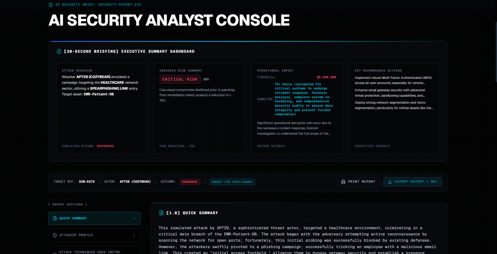

# 🛡️ Sentinel

### Learn Cybersecurity by Watching Attacks Unfold

🌐 **Live Demo:** https://sentinel-cyberlabs.vercel.app

⭐ **If you find this project interesting, consider starring the repository.**

---

## Overview

Sentinel is an educational cybersecurity simulation platform built to help students and beginners understand how modern cyber attacks work inside real-world environments.

Instead of reading static theory, users can interact with attack scenarios, visualize attack progression, explore MITRE ATT&CK techniques, and understand how defensive strategies reduce risk.

The project focuses on making cybersecurity concepts easier to learn through visual and interactive experiences.

---

## Landing Page

---

## Key Features

* Interactive Attack Simulation Builder
* AI Security Analyst Console
* Security Insights Dashboard
* MITRE ATT&CK Mapping
* Visual Attack Progression Workflow
* Multiple Industry Scenarios
* Educational Learning Experience
* Modern Cybersecurity Interface

---

## Attack Simulation Builder

Configure attack scenarios, select attacker profiles, define security strengths, and observe how different defenses impact attack outcomes.

---

## Security Dashboard

Analyze simulated attack results, identify risks, and understand how security controls influence the attack lifecycle.

---

## AI Security Analyst

An AI-powered analyst interface designed to explain attacks, security concepts, and mitigation strategies in a student-friendly way.

---

## Built With

* Next.js
* TypeScript
* Tailwind CSS
* Framer Motion
* Vercel

---

## Why This Project?

Cybersecurity can feel overwhelming when concepts are only explained through text.

Sentinel was built to make attack paths, attacker behavior, and defensive strategies easier to visualize and understand through interactive simulations.

The goal is simple:

> Make cybersecurity learning more practical, visual, and engaging.

---

## About Me

I'm Utkarsh Singh, an ECE student at JIIT Noida with a growing interest in cybersecurity and related fields.

Sentinel is one of my projects focused on combining learning, visualization, and cybersecurity education into a single platform.

---

### Live Website

🌐 https://sentinel-cyberlabs.vercel.app

### Repository

📂 https://github.com/utkarshsingh3011/SENTINEL
