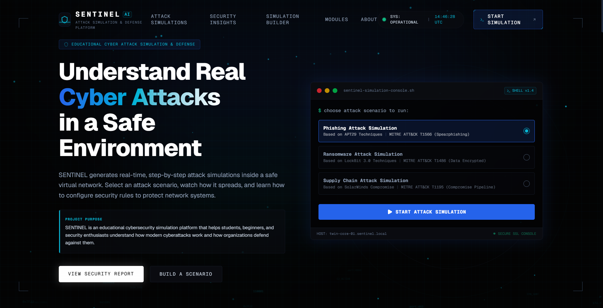
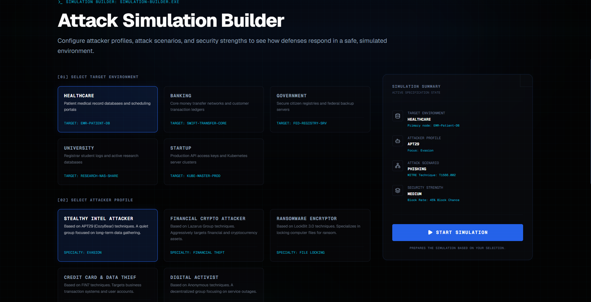
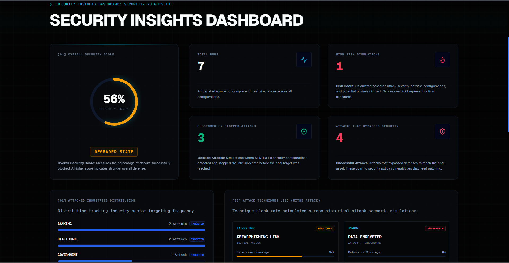

# 🛡️ Sentinel

### Learn How Cyber Attacks Work — By Watching Them Happen

🌐 **Live Demo:** https://sentinel-cyberlabs.vercel.app

📂 **Repository:** https://github.com/utkarshsingh3011/SENTINEL

🚀 **Release:** https://github.com/utkarshsingh3011/SENTINEL/releases

---

## Landing Page

---

## What is Sentinel?

Sentinel is an interactive cybersecurity simulation platform built to help students and beginners understand how modern cyber attacks unfold inside a network.

Instead of reading long theory-heavy explanations, users can visually explore attack paths, understand attacker behavior, and learn how defensive measures affect the outcome of an attack.

The goal is simple:

> Learn cybersecurity by seeing it in action.

---

## Why I Built This

While learning cybersecurity, I realized that many concepts such as phishing, lateral movement, privilege escalation, and data exfiltration are often difficult to visualize.

Most learning resources explain these topics through text or static diagrams.

Sentinel was built to create a more interactive learning experience where users can explore attack scenarios step by step and understand how security teams respond to them.

---

## Features

* Interactive Attack Simulation Builder
* Visual Attack Progression Workflow
* Security Insights Dashboard
* AI Security Analyst Console
* MITRE ATT&CK Technique Mapping
* Multiple Target Environments
* Real-time Simulation Generation
* Educational Cybersecurity Experience

---

## Screenshots

### Attack Simulation Builder

### Security Insights

### Attack Visualization

---

## Built With

* Next.js
* TypeScript
* Tailwind CSS
* Framer Motion
* Vercel

---

## Project Status

✅ Active Development

Future improvements include:

* Additional attack scenarios
* More MITRE ATT&CK mappings
* Expanded AI analyst capabilities
* Better reporting and analytics
* User-generated simulations

---

## About Me

I'm an ECE student at JIIT Noida with a growing interest in cybersecurity and related fields.

Sentinel is one of my projects focused on making cybersecurity concepts easier to understand through practical and visual learning experiences.

If you have feedback or ideas, feel free to connect.

---

⭐ If you found this project interesting, consider starring the repository.
